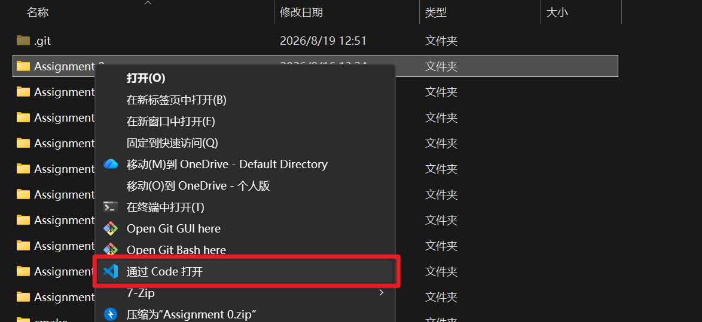
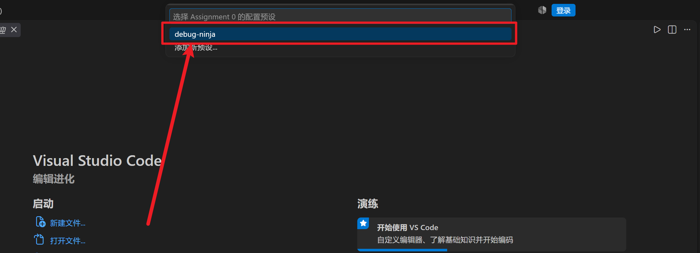
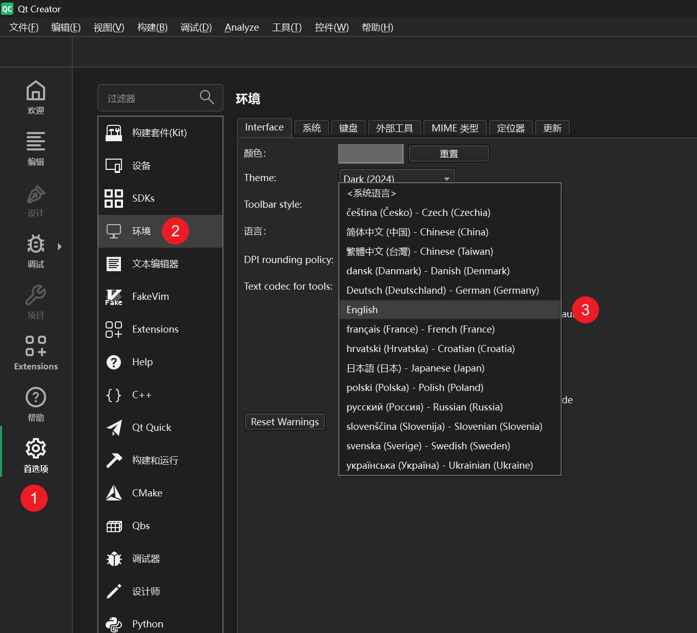
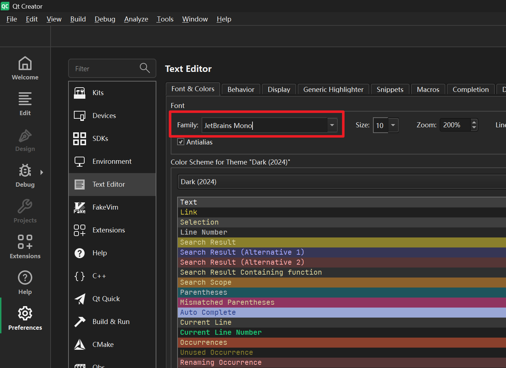
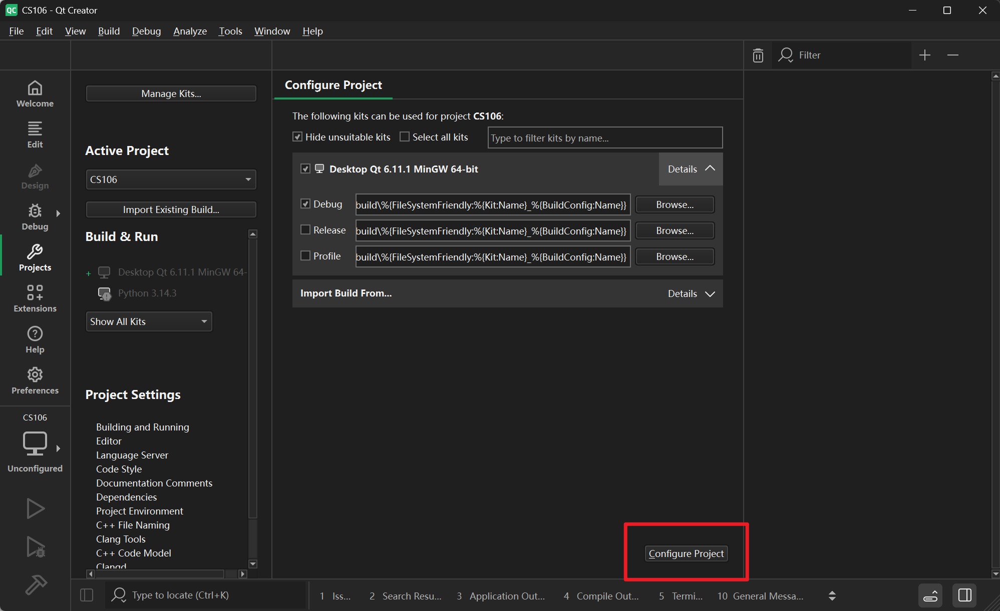

# CS106B 启动指南

由于CS106B的新版课程要求在校身份登录，所以在这里我们只能使用  [2022 年冬季学期的存档课程](https://web.stanford.edu/class/archive/cs/cs106b/cs106b.1224/assignments/a0/ )  

> 打开网页不知道要干嘛的话请点击 `页面顶部内导航` 的 `ASSIGNMENTS 作业`，跟随进度完成

22冬季提供所有自学所需要的文件和评测程序，故在这里分享一下详细的CS106B启动指南


<br><br>

---
# 使用Visual Studio Code完成cs106b
介于Qt的💩说不完，所以在这里为cs106b制作了一个用vscode开箱即用的版本
### 1.下载所需文件 并 解压到合适的位置
点击下载最新版本[Releases · jiangescn/cs106b-vscode](https://github.com/jiangescn/cs106b-vscode/releases)右键全部解压即可（文件较大，可能需要一定时间）
### 2.使用 VSCode 打开
右键 Assignment X 选择 `通过code打开` 


### 3.编译运行

选择 `debug-ninja` 按下 `F5` 即可启动编译并启动调试，没错就这么多。后面的教程不用看了  : (
<br>💩！

---

<br><br>

## 1.安装Qt

CS106B课程使用的集成开发软件是Qt，所以我们需要配置适用于Qt的新环境。

Qt的安装教程22冬季和新版的教程是共用的，故我们按照stanford的教程正常安装即可

### 1.1 安装包💩

这里记录两个比较💩的点，Qt安装必须要登录`Qt账号`这就意味着你需要注册一个。同时要求密码必须长达15个字符。而且会在很神秘的地方放置用户协议，需要仔细观察要不然很容易无法下一步。

### 1.2 设置选项💩

还有一点要注意的，Qt会自动识别系统语言尝试用中文显示UI，但是汉化做的是一坨大💩。在这种情况下你希望完成stanford完成的应用配置就是~~难如登天~~。所以在这里我建议将语言重新设置为`English`，~~起码这样可以根据英文教程完成推荐配置~~。具体`Language`更改路径如下 左侧栏的`首选项` - `环境` - `语言` - `English`



### 1.3.页面显示💩

Qt的默认字体显然不是很适合用来阅读和书写代码，在这里想向你推荐一个适合的字体[JetBrainsMono🔗](https://www.jetbrains.com/zh-cn/lp/mono/)    [蓝奏云下载🔗](https://wwavk.lanzoub.com/iqp1e40p7pif )



## 2. 下载 ASSIGNMENTS 作业 

前往QQ群文件或[`蓝奏云🔗`]( https://wwavk.lanzoub.com/ivFMj40p9sda ) 下载zip文件，解压后打开`CS106📁` 双击 `CS106.pro` 点击右下角的 `Configure Project`



然后点击左下角的`🔨` 开始 `Build Project`，如果构建成功，点击上面的`纯绿色三角`运行。如果出现了一个面板

```
What is your first name? 
```

就说明配置成功了

## 3. 开始完成 ASSIGNMENTS 作业 ！


## 4. 写在最后

自此我们终于可以开始学习了😭😭😭😭😭😭😭😭😭😭😭😭😭😭😭😭😭

看到我打出的那么多💩💩💩💩💩💩💩💩💩💩💩💩💩💩💩💩💩💩💩💩💩💩💩💩 就知道想要顺畅学习CS106B需要自己探索多少内容了，打开stanford的网站摸索好久不知道从哪里开始学习，摸索明白去学习最新版发现需要在校账号，拿以前老版本的发现环境无法编译，下载的Qt版本不对无法打开....

总结起来就是💩！但是经过了九九八十一难，守得云开见月明。配置好环境我们总算是可以享受到来自世界名校的高质量课程了。在这里由衷的感觉前面各位学长的抹黑探索，祝大家学习愉快！


